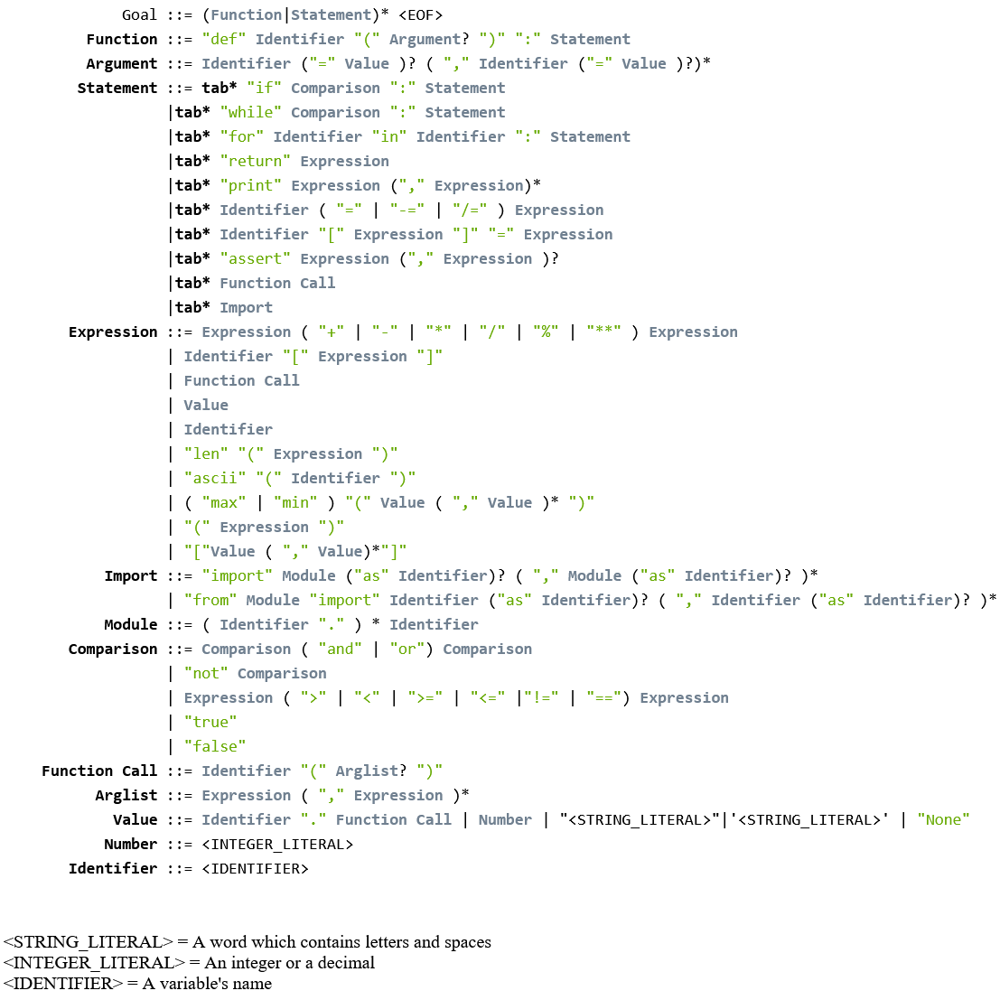
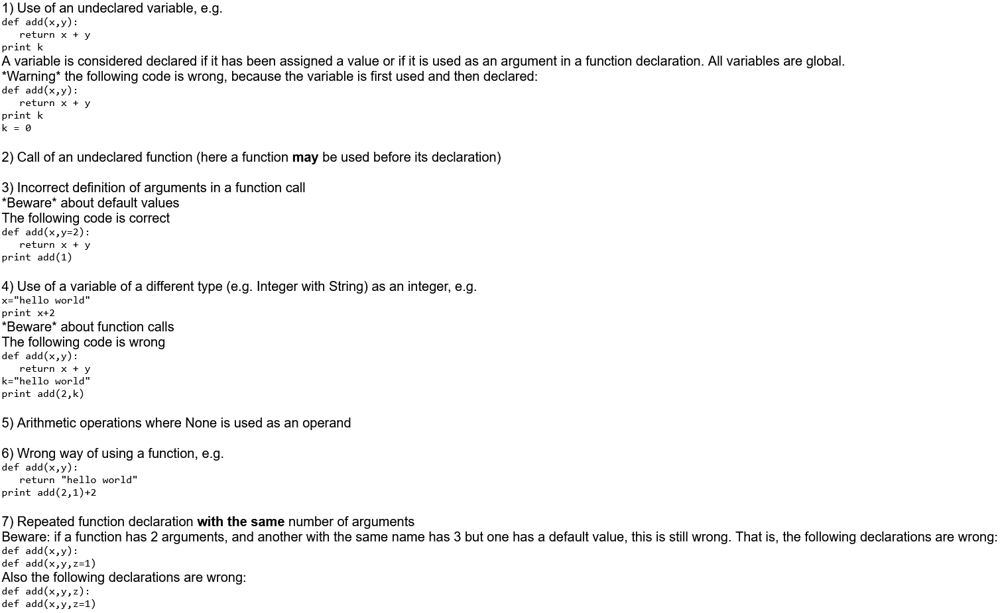

# Mini python compiler
The objective of this project was to build a compiler's grammar as well as create the compiler's Lexer, Syntax and Semantics check using [SableCC](https://sablecc.org/). It was developed during the 5th semester as part of the Compilers course at AUEB.

## Tasks

We were tasked with implementing a compiler for a simplifies version of Python (MiniPython) based on the following BNF:

Our compiler should be aware of the following rules and inform the user when it discovers an error:
 

## How to run

1. Download the repository

2. Open command prompt on the root of the project

3. Execute the grammar using `sablecc minipython.grammar`
   
4. Compile all Java files with `javac *.java`

5. To find compilation errors from our relative [example](minipythonexample.py) type `java ASTTest1 minipythonexample.py`

## Contributors
- [Iosif Petroulakis](https://github.com/Morthlog) (worked on [Second visitor](VisitorSecondPass.java) and on [grammar](minipython.grammar))
- [Nikolaos Tomaras](https://github.com/All0cator) (worked on most of [First visitor](VisitorFirstPass.java) and on [grammar](minipython.grammar))
- [Alexandros Mpletsis](https://github.com/AlexBle) (worked on most of the [grammar](minipython.grammar))